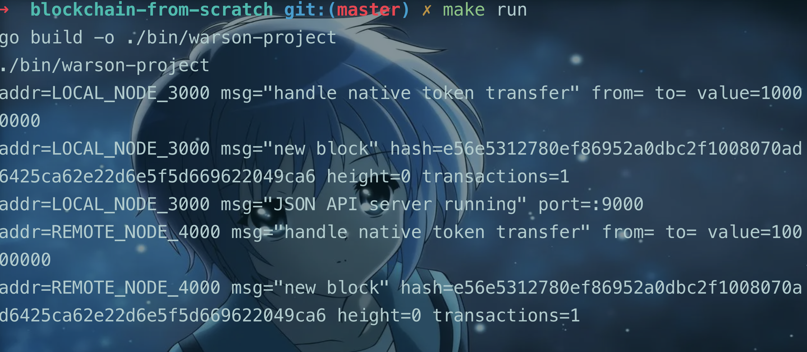
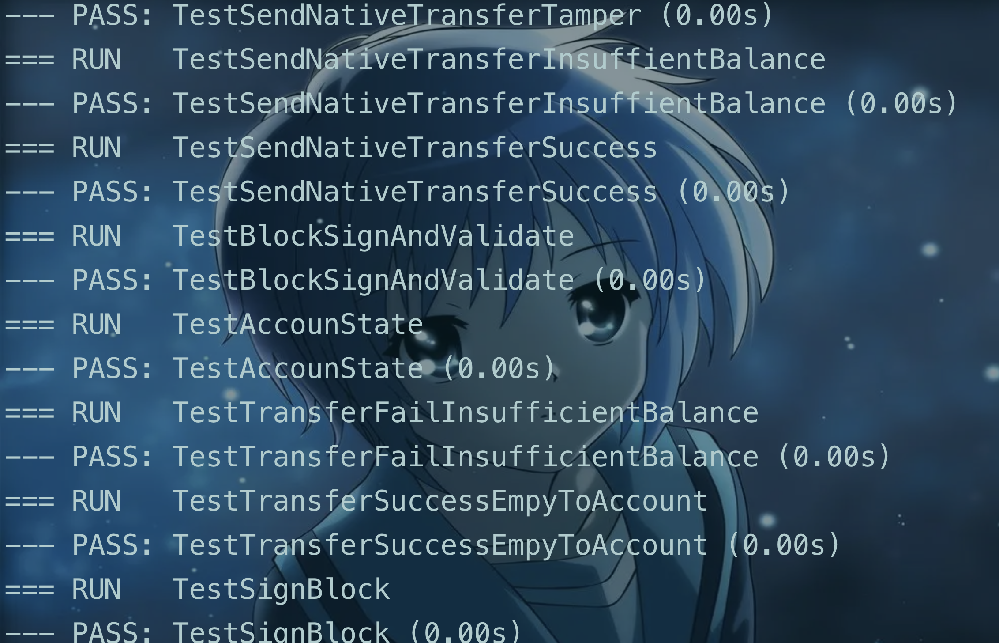

# blockchain from scratch

这是一个区块链学习项目，用 go 语言从零构建一个在本地运行的区块链，实现了数据加解密、节点间的 block 同步，还有一个简单的 vm 虚拟机逻辑，实现基本的数学加减指令。

实现的数据结构包含

- block (区块)
- transaction (事务)
- blockchain (区块链)
- server (运行节点)
- vm (模拟虚拟器)
- tcpTransacport (使用 TCP 协议来同步数据)
- message (rpc 消息载体)
- address (地址)
- PrivateKey & PublicKey （椭圆曲线数字签名算法 ECDSA）

# 特别说明

这个项目是跟油管技术大牛 Anthony GG 学习的，这个项目的代码结构是很优美的，很有设计理念，也可以加深自己对设计模式的理解。但是我没有照抄 Anthony 的代码，原因是他的版本有可以优化的地方，也有一些他没有察觉的 bug，在学习的过程中我基本都有做一些小优化，顺便修复一些 bug，你也可以看看我的笔记 [note.md](note.md) 来具体的优化和 fix 是什么,也可以去看看我给源项目提的 pr

## 源项目资源：

- youtube 链接：https://www.youtube.com/playlist?list=PL0xRBLFXXsP6-hxQmCDcl_BHJMm0mhxx7
- github 源项目链接：https://github.com/anthdm/projectx

## 我提的 pr

- [Fix transaction sign](https://github.com/anthdm/projectx/pull/5)
- [fix tcp truncation](https://github.com/anthdm/projectx/pull/4)

# how to run

make run

# how to test

make test

